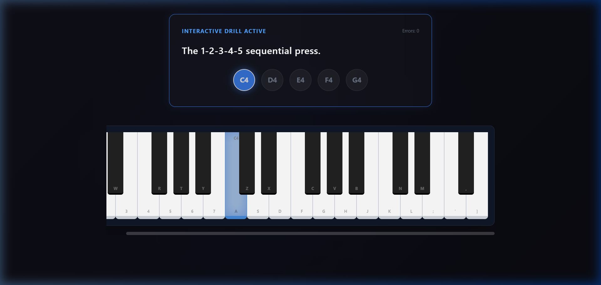

# Global Piano Academy 🎹

A professional-grade, interactive, 4-phase web application explicitly designed to train absolute beginners into capable piano performers. Built with **React, TypeScript, Vite, TailwindCSS (V4), and Tone.js**, this is far more than a simple MIDI keyboard toy—it is a deeply structured E-Learning SaaS architecture.



## Features

- **The 4-Phase Curriculum**: A complete pedagogical roadmap divided into specific, unlockable Modules ranging from *Foundation & Posture* to deep *Chords & Arpeggios*.
- **The Granular 3-Tier Routing Engine**: Seamless transition between the **Conservatory Dashboard** → **Module Detail Breakdown** → **Independent Sub-Mission Drill**.
- **Interactive Synthesia Gameplay Simulator**: 
  - Drag and drop **any .mid file in the world** directly onto the Dashboard.
  - The application natively reads the tracks, schedules the absolute audio timeline, and forces the physical piano keys to light up perfectly in sync with the song to teach you visually.
  - Evaluate your accuracy with a built-in rhythm game validator (Green for immediate success, Red for tracking misses).
- **Infinite Tone Engine**: Bypasses browser latency policies strictly by compiling MIDI time directly against native `AudioContext` nodes and passing sequences accurately down physical UI components cleanly to eradicate race conditions.

## Local Setup & Development

This project uses the modern Node ecosystem (Vite) and does not require complex backend scaffolding to execute.

### 1. Requirements
Ensure you have [Node.js](https://nodejs.org/) installed (v18+ recommended).

### 2. Installation
Clone the repository and install all strict package dependencies.
```bash
git clone https://github.com/YourName/Piano-Lesson.git
cd Piano-Lesson
npm install
```

### 3. Run the Conservatory locally
Launch the fast development server:
```bash
npm run dev
```
Open `http://localhost:5173/` in your browser.

## Built With
- **React 18** *(Component Architecture)*
- **Tone.js** *(Precision Audio & Transport Engine)*
- **@tonejs/midi** *(In-browser binary sequencing)*
- **TailwindCSS 4** *(Glassmorphism, utility-first aesthetics)*
- **TypeScript** *(Strict validation and interface adherence)*

> "Master the keyboard step-by-step, or simply drop a song and jam immediately."
